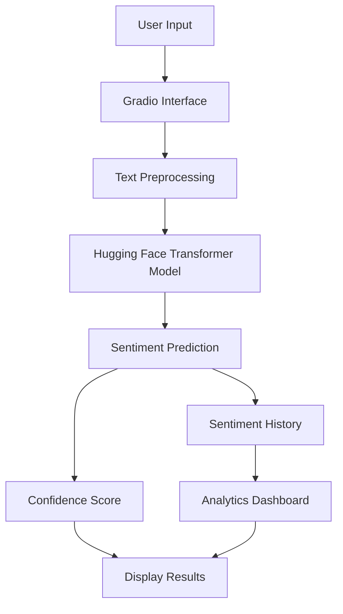
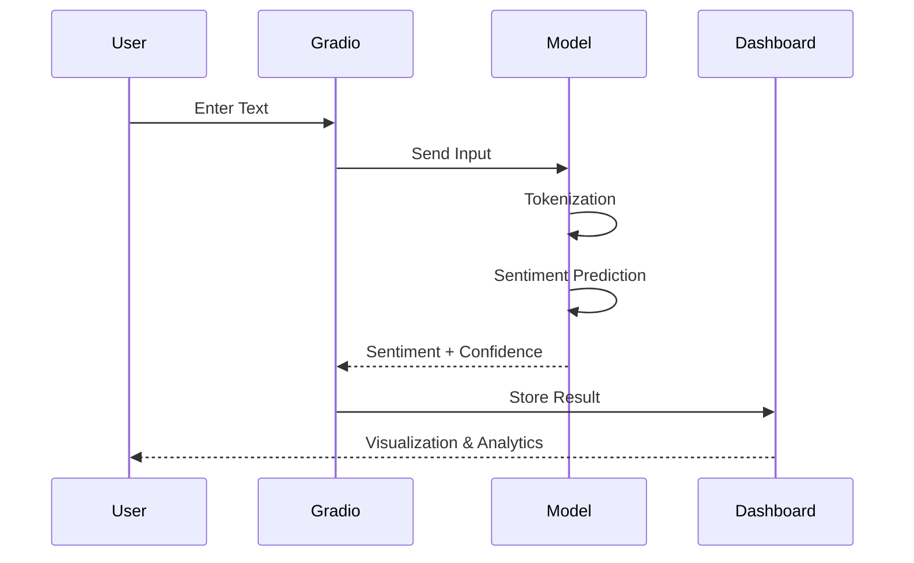
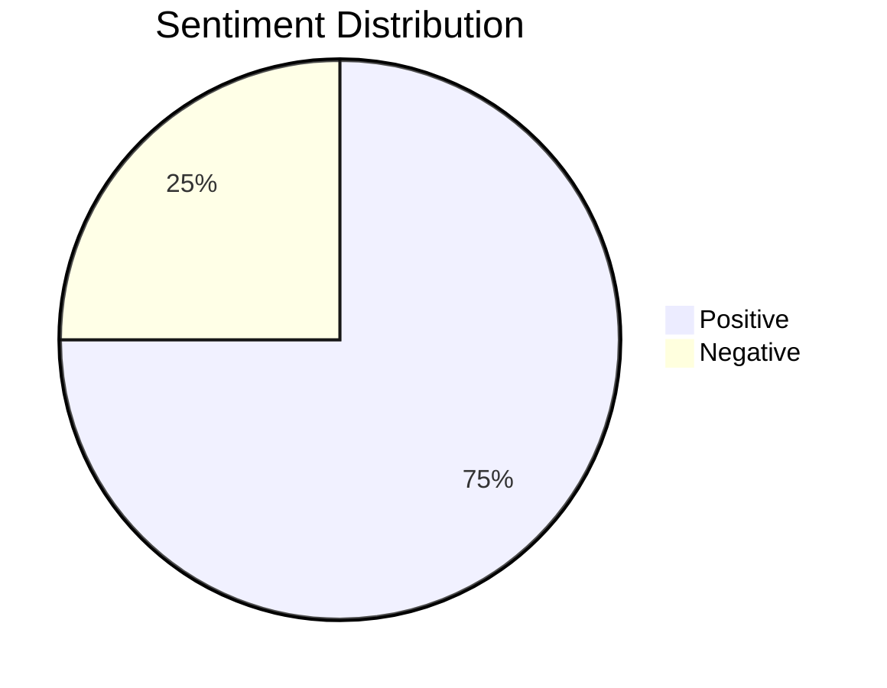
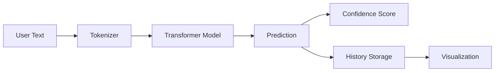
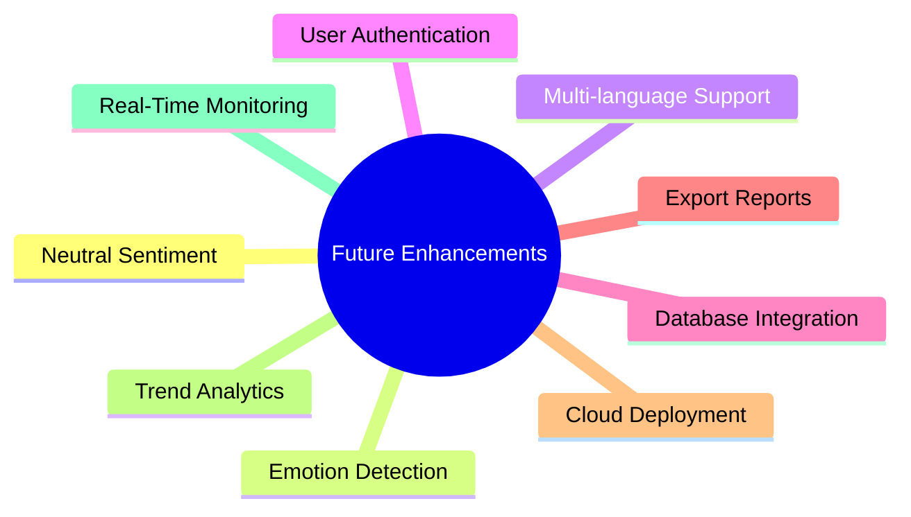

# 🤖 AI-Powered Sentiment Analysis System

An interactive **Natural Language Processing (NLP)** application that performs real-time sentiment analysis using a pretrained Transformer model from Hugging Face. The application features a user-friendly Gradio interface, confidence scoring, sentiment history tracking, and visual analytics.

---

## 📋 Overview

This project leverages the power of **Transformer-based deep learning models** to classify text sentiment as **Positive** or **Negative**. Users can enter text through a web interface and instantly receive sentiment predictions along with confidence scores and visual insights.

### Key Highlights

- 🚀 Real-time sentiment analysis
- 🤗 Hugging Face Transformer integration
- 🎯 Confidence score calculation
- 📊 Sentiment analytics dashboard
- 🖥️ Interactive Gradio web interface
- 📈 Historical sentiment tracking

---

## 🏗️ System Architecture



---

## ⚙️ Tech Stack

| Component | Technology |
|------------|------------|
| Frontend | Gradio |
| NLP Model | Hugging Face Transformers |
| Deep Learning | PyTorch |
| Data Processing | Pandas |
| Visualization | Matplotlib |
| Programming Language | Python |

---

## 📂 Project Structure

```text
sentiment-analysis-system/
│
├── chatbot.ipynb
├── README.md
│
├── assets/
│   └── screenshots/
│
├── requirements.txt
│
└── outputs/
    └── sentiment_charts/
```

---

## 🔄 Workflow



---

## 🧠 Model Details

### Pretrained Model

```text
distilbert-base-uncased-finetuned-sst-2-english
```

### Model Characteristics

| Feature | Value |
|----------|--------|
| Architecture | DistilBERT |
| Task | Binary Sentiment Classification |
| Dataset | Stanford Sentiment Treebank (SST-2) |
| Output Classes | Positive, Negative |
| Framework | PyTorch |

---

## 🚀 Installation

### 1. Clone Repository

```bash
git clone https://github.com/yourusername/sentiment-analysis-system.git

cd sentiment-analysis-system
```

### 2. Create Virtual Environment (Optional)

```bash
python -m venv venv

# Windows
venv\Scripts\activate

# Linux/Mac
source venv/bin/activate
```

### 3. Install Dependencies

```bash
pip install gradio transformers torch pandas matplotlib
```

Or:

```bash
pip install -r requirements.txt
```

---

## ▶️ Running the Application

### Using Jupyter Notebook

```bash
jupyter notebook chatbot.ipynb
```

Run all cells.

### Using Python Script

```bash
python app.py
```

Gradio will launch a local web application:

```text
http://127.0.0.1:7860
```

---

## 📊 Features

### 1️⃣ Sentiment Analysis

Analyzes text and predicts:

- 😊 Positive
- 😔 Negative

Example:

```text
Input:
"I absolutely love this product."

Output:
Sentiment: POSITIVE
Confidence: 99.34%
```

---

### 2️⃣ Confidence Score

Displays prediction certainty.

```text
Confidence: 98.76%
```

This helps users understand how strongly the model believes its prediction.

---

### 3️⃣ Sentiment Analytics Dashboard

Tracks historical sentiment predictions and generates visual summaries.

Example chart:



---

### 4️⃣ Historical Tracking

Each analyzed text is stored in session history for trend analysis and visualization.

---

## 📈 Data Flow Diagram



---

## 🖥️ User Interface Components

| Component | Purpose |
|------------|---------|
| Textbox | Accept user text |
| Analyze Button | Trigger prediction |
| Sentiment Label | Show sentiment |
| Confidence Display | Show certainty score |
| Dashboard | Display analytics |
| History Panel | Track previous analyses |

---

## 🧪 Example Inputs

### Positive Example

```text
This movie was amazing and exceeded my expectations.
```

Output:

```text
😊 POSITIVE
Confidence: 99.12%
```

---

### Negative Example

```text
I am disappointed with the service and quality.
```

Output:

```text
😔 NEGATIVE
Confidence: 98.47%
```

---

## 📊 Performance Considerations

### Advantages

- Fast inference
- Lightweight DistilBERT architecture
- High sentiment classification accuracy
- Easy deployment with Gradio

### Limitations

- Binary sentiment only
- Limited context understanding in complex texts
- No sarcasm detection
- No multilingual support by default

---

## 🔮 Future Improvements



### Planned Features

- Multi-class sentiment analysis
- Emotion recognition
- Sentiment trend tracking
- CSV/PDF export
- User management
- API integration
- Cloud deployment (AWS, Azure, GCP)

---

## 📦 Requirements

```txt
gradio
transformers
torch
pandas
matplotlib
```

---

## 🤝 Contributing

Contributions are welcome.

1. Fork the repository
2. Create a feature branch

```bash
git checkout -b feature/new-feature
```

3. Commit changes

```bash
git commit -m "Add new feature"
```

4. Push branch

```bash
git push origin feature/new-feature
```

5. Open a Pull Request

---

## 📜 License

This project is available for educational, academic, and research purposes.

---

## 👨‍💻 Author

**AI-Powered Sentiment Analysis System**

Built using:

- Python
- Gradio
- Hugging Face Transformers
- PyTorch
- Pandas
- Matplotlib

---

⭐ If you found this project useful, consider giving it a star on GitHub!
